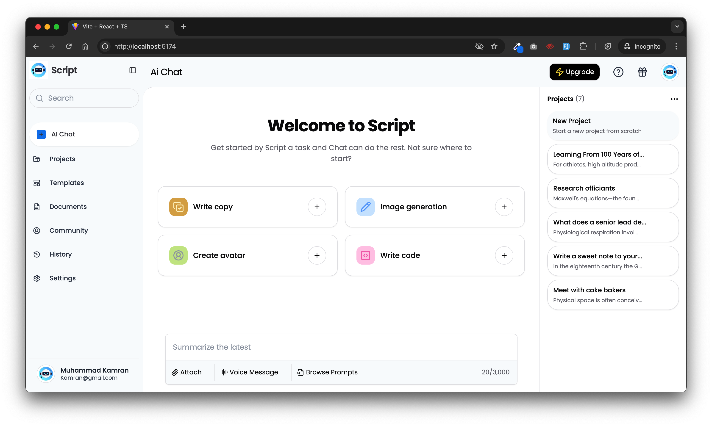

# Script Ui Chatbot

Script Ui Chatbot is a web application designed to facilitate AI-driven chat interactions and project management. The dashboard includes features such as chat history, project management, and various utilities to enhance user experience.

## Features

- AI Chat with history
- Project management
- Responsive design
- Sidebar navigation
- User account management

## Screenshot



## Getting Started

Follow these instructions to set up and run the project on your local machine.

### Prerequisites

- Node.js (v23 or higher)
- npm (v9 or higher) or yarn

### Installation

1. Clone the repository:

   ```sh
   git clone https://github.com/zubairkofficial/Script-Chatbot-ui.git
   cd Script-Chatbot-ui/
   ```

2. Install dependencies:

   ```sh
   npm install
   # or
   yarn install
   ```

### Running the Application

1. Start the development server:

   ```sh
   npm run dev
   # or
   yarn dev
   ```

2. Open your browser and navigate to `http://localhost:3000`.

### Building for Production

To build the project for production, run:

```sh
npm run build
# or
yarn build
```

### Deployment

You can deploy the project using any static site hosting service. For example, to deploy on Vercel:

1. Install Vercel CLI:

   ```sh
   npm install -g vercel
   ```

2. Deploy the project:

   ```sh
   vercel
   ```

## Contributing

Contributions are welcome! Please open an issue or submit a pull request for any improvements or bug fixes.

## License

This project is licensed under the MIT License. See the [LICENSE](./LICENSE) file for details.

## Contact

For any inquiries or support, please contact [zaindev@duck.com](mailto:zaindev@duck.com).